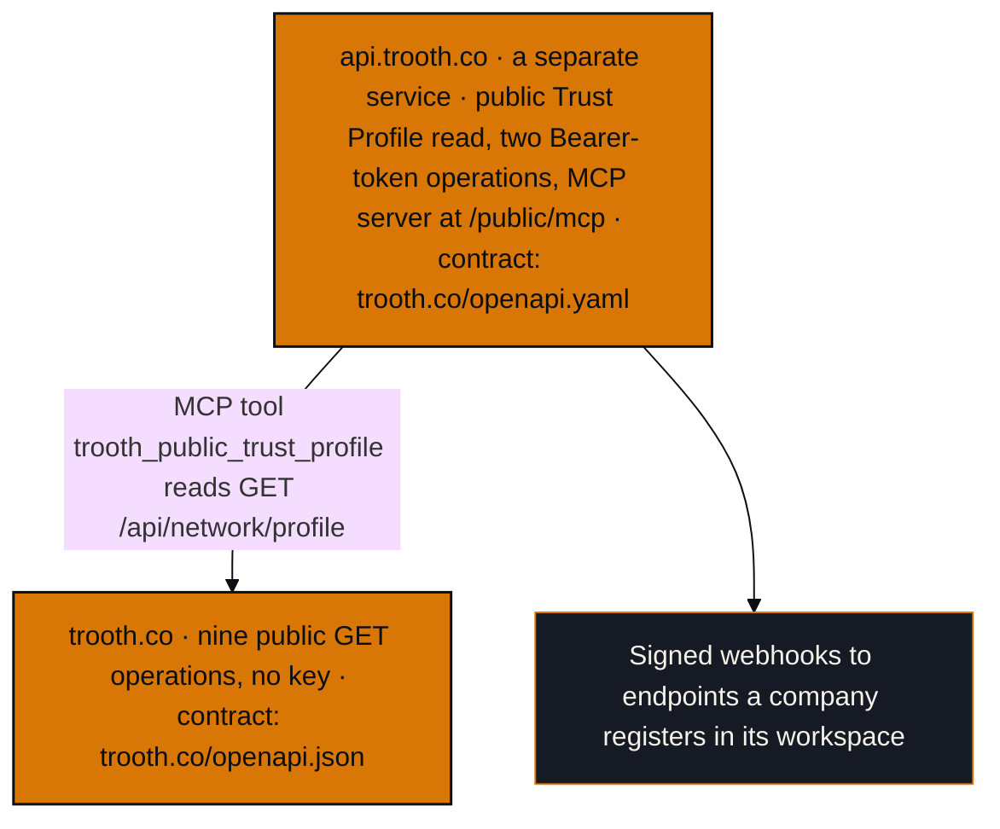

# Architecture

The Trooth Network is Trooth's only product: one public, signed, machine-readable
record per company. Two hosts serve it, and each has its own published contract.
This page names them and points at those contracts. It does not restate them, and
where it disagrees with one of them, the contract is right.

## Trust boundary

Trooth signs what it witnessed. It never signs on a company's behalf. A witnessed
value says what a reading found, from a named source, on a stated date. It does not
say that a company's claim is true. What a company says about itself is declared or
attested by the company, and it is kept apart from what Trooth witnessed and from
public record.

No response carries a figure, a rank or a grade for a company. Neither `witnessed`
nor `updatedAt` is an audit opinion, and a caller restating either one elsewhere
must carry the limits in the `methodology` object with it. The public read carries
no signature today, so a caller cannot check Trooth's signature from it. Trooth's
public signing keys are listed at
[trooth.co/verify/keys](https://trooth.co/verify/keys).

## Data flow, end to end

1. A company publishes its record on the Network
   ([trooth.co/get-started](https://trooth.co/get-started)).
2. Trooth reads the company's public surface on an hourly cadence and records each
   reading. `GET /api/network/profile` on trooth.co returns the result in its
   `witnessed` block: the `standing` field (the API's name for the witnessed state,
   either `witnessed` or null), the first and the most recent reading,
   `checksPassed` out of `checksRun` (checks that read as expected, out of checks
   run) and the unbroken run of readings. Every response also carries a
   `methodology` object that states the cadence, the gap tolerance, the retention
   period, the freshness windows and what Trooth does not read.
3. Anyone can read a record with no credential: through the nine public operations
   on trooth.co, through `GET /public/trust/{slug}` on api.trooth.co, or through the
   MCP server at `https://api.trooth.co/public/mcp`, whose `trooth_public_trust_profile` tool
   reads the trooth.co profile.
4. A company that registers a webhook endpoint in its workspace receives signed
   events from api.trooth.co. The `x-trooth-signature` header is the HMAC-SHA256 of
   the raw request body, keyed with the endpoint's signing secret. Trooth makes one
   attempt per event and does not retry on its own, and no timestamp is signed on
   this channel, so a receiver deduplicates on the event `id`. The files in
   `examples/` check this channel only. Alert destinations are a second channel,
   delivered by the Trooth application, and they sign a timestamp and the body
   under a different scheme, described at
   [trooth.co/docs#webhooks](https://trooth.co/docs#webhooks).

## Where the contracts are kept

The contracts are produced where the routes live, not in this repository.
trooth.co/openapi.json says it is generated from the website's `app/api` tree, and
that a build gate fails when the document and the source disagree.
trooth.co/openapi.yaml describes the service at api.trooth.co, and its own change
record says each of its paths was traced to the handler that serves it on
2026-09-03. Where a file in this repository disagrees with either served contract,
the served contract is right.
