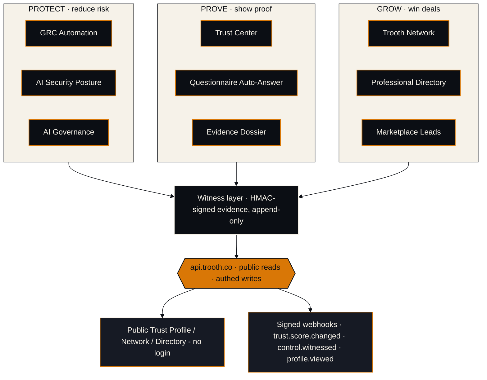

# Architecture

Three pillars, nine capabilities, one witness layer. Every capability writes to and
reads from the same signed evidence store; the public surface exposes only what a
company has chosen to publish.

## Trust boundary

The witness layer records what a scan observed and signs it. It does not assert that a
claim is true — it asserts that, at a point in time, evidence was witnessed. The
`advisory: true` flag rides on every payload. A buyer confirms independently using the
open-source verifier; Trooth is never in the position of certifying compliance or
signing a customer's claim.

## Data flow, end to end

1. A vendor runs a scan (`/v1/grc/scan`, the GitHub Action, or the CLI). PROTECT
   capabilities emit findings.
2. Findings are witnessed and signed into the append-only evidence store (witness layer).
3. PROVE capabilities render that evidence: the public Trust Profile, questionnaire
   drafts, and per-control dossiers — each carrying its signature.
4. GROW capabilities index published profiles: the Network, the Directory, and the
   buyer-intent leads that profile activity generates.
5. State changes emit signed webhooks so downstream systems stay current without polling.

## Why one platform, not nine repos

Stripe, Plaid, and Vanta ship a single canonical spec plus a small set of real SDKs —
not one repository per feature. A capability is a module behind the same contract, the
same auth, and the same witness guarantees. Splitting them into nine repos would
fragment the schema, duplicate auth, and dilute the one thing developers actually want:
a single source of truth they can import and trust.
